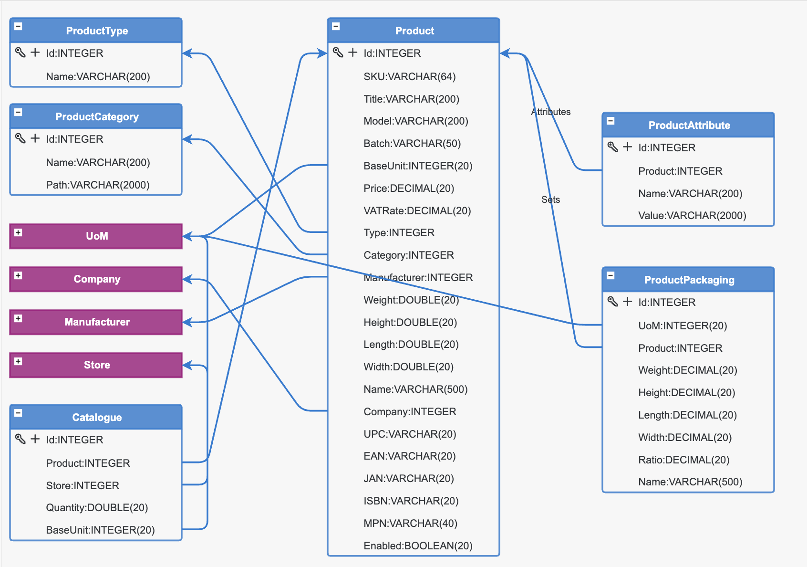
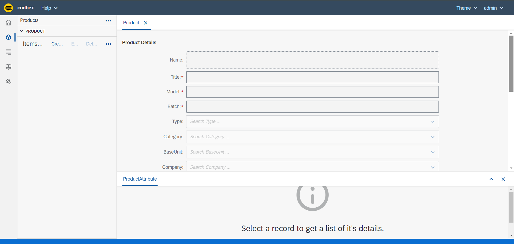
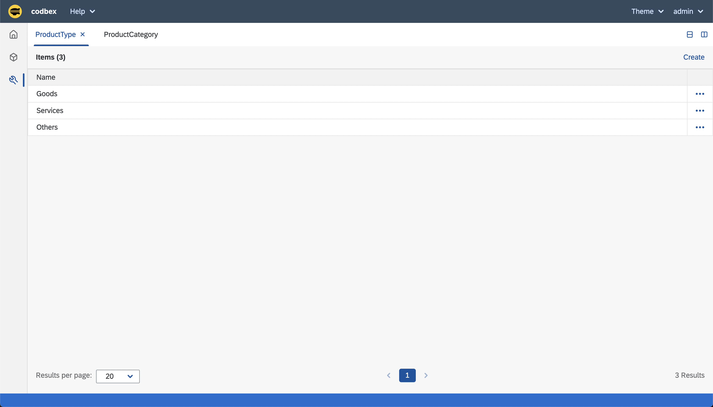

# codbex-products
Products Management Application

### Model

### Application

#### Launchpad

#### Management

### Infrastructure

#### Build

	docker build -t products-uoms:1.0.0 .

#### Run

	docker run --name products-uoms -d -p 8080:8080 products-uoms:1.0.0

#### Clean

	docker rm products-uoms